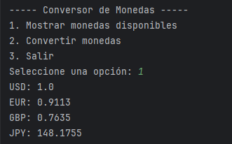
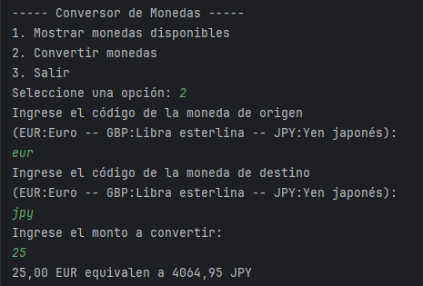
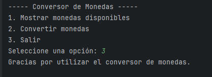

# Conversor de Monedas

## Descripción del Proyecto

Este proyecto es un **Conversor de Monedas** desarrollado en Java, que permite realizar conversiones entre diferentes divisas utilizando tasas de cambio actualizadas 
obtenidas desde una API de tasas de cambio. El programa es interactivo y presenta una interfaz en la consola, donde el usuario puede seleccionar monedas, 
ingresar el monto a convertir y visualizar los resultados en tiempo real.

## Funcionalidades

- Obtener tasas de cambio actualizadas desde una API.
- Conversión entre monedas según la tasa de cambio más reciente.
- Menú interactivo en consola:
  - Mostrar las monedas disponibles.
  - Ingresar monedas para la conversión (origen y destino).
  - Convertir el monto especificado.
  - Salir del programa.
- Validación de monedas ingresadas.

## Requisitos Previos

- **Java 11** o superior instalado.
- Conexión a internet para realizar solicitudes HTTP a la API.

## API Utilizada
- Este proyecto utiliza la ExchangeRate-API para obtener las tasas de cambio actualizadas.
- La respuesta es procesada en formato JSON para realizar las conversiones.

## Usar el programa:

- Selecciona la opción (1) para mostrar las monedas disponibles.

- 

- Selecciona la opción (2) para convertir las monedas.
- Ingresa las monedas de origen y destino, junto con el monto a convertir.
- El programa calculará el valor convertido y lo mostrará en la consola.

- 

- Escoge la opcion (3) salir para terminar el programa

- 
 
## Mejoras Futuras
- Implementar un historial de conversiones.
- Añadir soporte para múltiples conversiones en una sola ejecución.
- Implementar una interfaz gráfica (GUI).

